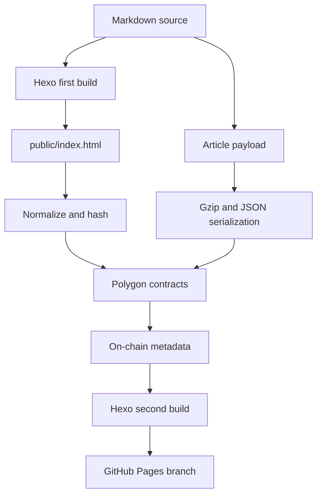

普通静态博客解决了「如何发布」的问题，却没有完全解决「如何证明」的问题：文章是否被修改过、某个版本究竟何时出现、网站关闭后还能不能验证原始内容，都依赖站长和托管平台。

方案：Hexo 负责生成网站，GitHub Actions 负责自动构建，Polygon PoS 负责保存首页和文章数据，GitHub Pages 负责提供正常的网页访问体验。

## 最终架构

整个发布过程可以概括为：



这里有两个相互独立的合约：

- `HomepageArchive` 保存首页 HTML、内容哈希、发布时间和版本号。
- `ArticleArchive` 以文章 `slug` 的哈希为键，保存文章 JSON、内容哈希和版本信息。

网页仍然从 CDN 或 GitHub Pages 加载，因此访问速度和普通 Hexo 博客没有区别。区块链负责提供一份公开、可验证、不能悄悄改写的发布记录。

## 准备环境

本地需要 Node.js、pnpm、Git 和一个 Polygon 钱包：

```bash
node --version
pnpm --version
git --version
```

安装依赖并验证 Hexo：

```bash
pnpm install --frozen-lockfile
pnpm clean
pnpm build
pnpm server
```

生产发布使用 Polygon 主网，链 ID 是 `137`，Gas 代币是 `POL`。建议单独创建一个只负责发布的钱包，不要直接使用存放主要资产的钱包。

## 先设计文章的链上格式

文章不能直接把 Hexo 生成后的 HTML 原样塞进合约。HTML 会混入主题结构、构建元数据和样式细节，主题稍微调整就会让全部文章产生新版本。

我最终使用下面的规范化 JSON：

```json
{
  "title": "Article title",
  "slug": "4",
  "date": "2026-08-10T12:00:00Z",
  "content": "H4sIAAAAA...",
  "images": [
    {
      "name": "architecture.png",
      "hash": "5d41402abc4b2a76b9719d911017c592"
    }
  ]
}
```

`content` 不是普通 Markdown，而是经过以下处理后的结果：

1. 将换行统一为 `LF`，去掉首尾空白，并确保末尾只有一个换行。
2. 使用 gzip level 9 压缩 Markdown。
3. 将压缩结果编码为 Base64，保证 JSON 可以稳定序列化。
4. 使用 UTF-8 编码整个 JSON，再写入合约的 `bytes`。

确定性非常重要。同一篇文章无论在 Windows 还是 Linux 构建，都必须得到相同的字节序列。否则 GitHub Actions 每运行一次，就可能误判为新内容并支付一次 Gas。

文章内容哈希没有直接计算压缩后的 Base64，而是对包含规范化 Markdown 的语义 JSON 计算 `keccak256`。这样哈希表达的是文章内容本身，而不是某个压缩器版本的输出细节。

```js
const semanticJson = JSON.stringify({ ...payload, content: markdown });
const contentHash = keccak256(toUtf8Bytes(semanticJson));
```

### 图片哈希

本地图片可以读取真实二进制并计算哈希，但远程图片存在一个经常被忽略的问题：构建机未必能稳定下载它们，远端还可能有防盗链、超时或内容动态变化。

当前实现对外链图片计算的是「图片 URL 字符串的 MD5」，它只能标识文章引用了哪个地址，**不能证明该地址返回的图片内容，也不能保证图片永久可用**。

如果要做严格的永久图片归档，可以选择：

- 将图片上传到 IPFS，并把 CID 写进文章。
- 使用 Arweave 保存图片二进制。
- 在发布阶段下载图片，计算 SHA-256 或 Keccak-256，并把文件同步到不可变对象存储。
- 对非常小的图片直接上链，但成本通常不合理。

因此，「文章 Markdown 已上链」和「文章引用的所有资源都已永久保存」是两件不同的事。

## Solidity 合约设计

文章合约的核心结构并不复杂：

```solidity
struct Publication {
    bytes payload;
    bytes32 contentHash;
    bytes32 payloadHash;
    uint256 version;
    uint256 publishedAt;
    uint256 publishedAtBlock;
}

mapping(bytes32 => Publication) private publications;
```

写入时不直接使用字符串 `slug`，而是先计算：

```js
const slugHash = keccak256(toUtf8Bytes(slug));
```

合约的 `publish` 函数需要完成几项检查：

```solidity
function publish(
    bytes32 slugHash,
    bytes calldata payload,
    bytes32 contentHash
) external {
    if (msg.sender != owner) revert NotOwner();
    if (payload.length == 0) revert EmptyPayload();
    if (payload.length > MAX_ARTICLE_BYTES) revert PayloadTooLarge(...);
    if (publications[slugHash].contentHash == contentHash) {
        revert UnchangedContent();
    }

    // 保存数据、增加版本，并发出事件
}
```

我把单篇文章限制为 `24,576` 字节。这里限制的是最终 JSON 的 UTF-8 字节数，不是 Markdown 文件大小。gzip 会缩小正文，但 Base64 又会增加大约三分之一体积，所以一定要在发交易前检查最终 payload。

合约同时保存两个哈希：

- `contentHash` 用来判断文章的语义内容是否变化。
- `payloadHash` 是合约对实际写入 `bytes` 计算的 `keccak256`，用来验证链上原始字节。

### 「永久」到底指什么

当前结构每次更新会覆盖 `publications[slugHash].payload`，因此合约读取接口只能直接返回最新版本。旧版本仍然存在于区块链历史、交易 calldata 和事件中，但不能通过当前 mapping 直接查询。

如果需要让每个历史版本都能从合约方法直接读取，应改成：

```solidity
mapping(bytes32 => mapping(uint256 => Publication)) private versions;
mapping(bytes32 => uint256) public latestVersion;
```

代价是持续增长的合约存储和更高的 Gas。对个人博客而言，保留最新可读版本，同时依靠交易历史证明旧版本，是一个更实际的折中。

## 使用 CREATE2 固定合约地址

CI 不能依赖某个本地保存的部署结果，因此我使用 CREATE2 预先计算合约地址：

```js
const address = getCreate2Address(
  deterministicDeployer,
  salt,
  keccak256(initCode)
);
```

`initCode` 包含合约字节码和构造参数。只要部署器、salt、编译结果和 owner 完全一致，最终地址就一致。发布脚本会先调用 `eth_getCode`：如果地址上没有代码就部署，有代码就直接复用。

这里的坑是，**更换发布钱包也会改变合约地址**，因为 owner 是构造参数的一部分。升级 Solidity 版本、修改优化参数、调整合约代码或 salt，同样会得到新地址。不要在没有迁移计划时随意修改这些值。

## 发布脚本如何避免重复交易

文章发布脚本会扫描 `source/_posts`，并要求文件名与数字 slug 一致：

```text
source/_posts/1.md -> /archives/1/
source/_posts/2.md -> /archives/2/
source/_posts/4.md -> /archives/4/
```

数字 slug 必须是正整数且不能重复。它既是网页永久链接的一部分，也是链上文章的逻辑主键。发布过后不要把原文章换到另一个 slug，否则链上会被视为一篇全新的文章。

对于每篇文章，脚本先读取链上记录：

```js
const previous = await contract.publication(article.slugHash);

if (previous.contentHash === article.contentHash) {
  console.log(`Article ${article.slug} is unchanged`);
} else {
  await contract.publish(
    article.slugHash,
    article.bytes,
    article.contentHash
  );
}
```

这意味着每次 CI 都可以扫描全部文章，但只有新增或真正修改的文章会发送交易。没有变化的文章会根据发布区块查询历史事件，恢复交易哈希并生成展示元数据。

发送前还要执行 `estimateGas`，并预留 20% 的 gas limit 缓冲：

```js
const estimated = await wallet.estimateGas(transaction);
const gasLimit = (estimated * 120n) / 100n;
```

余额检查必须使用网络返回的 `maxFeePerGas` 或 `gasPrice`。合约首次部署通常比后续发布贵，而保存完整 HTML 或 JSON 的成本会随着字节数明显增加。

## 首页为什么需要单独规范化

首页保存的是 Hexo 生成后的完整 HTML，但页面底部包含构建哈希和构建时间，页面中还会显示上一次发布的区块高度与交易哈希。如果直接对 HTML 求哈希，会形成一个循环：

```text
构建时间变化 -> HTML 哈希变化 -> 再次上链
链上信息变化 -> HTML 再次变化 -> 再次上链
```

解决方法是在计算 `contentHash` 前，移除两个动态区域：

```js
normalized = normalized.replace(
  /<footer class="site-footer">[\s\S]*?<\/footer>/g,
  '<footer class="site-footer"></footer>'
);

normalized = normalized.replace(
  /<!-- onchain-metadata:start -->[\s\S]*?<!-- onchain-metadata:end -->/g,
  '<!-- onchain-metadata -->'
);
```

替换逻辑应该要求每个区域恰好出现一次。静默忽略模板结构变化很危险，因为某次主题修改可能让动态字段重新进入哈希，造成每次构建都重复付费。

需要注意：合约实际保存的是当次构建的完整 HTML，规范化只用于计算内容哈希和去重。只改变构建时间时不会覆盖链上的旧 HTML，这是预期行为。

## GitHub Actions 双构建流程

工作流只监听 `main` 分支，并授予 `contents: write` 权限：

```yaml
on:
  push:
    branches: [main]
  workflow_dispatch:

permissions:
  contents: write
```

完整步骤如下：

1. 安装固定版本的 pnpm 和 Node.js。
2. 使用 `pnpm install --frozen-lockfile` 安装依赖。
3. 更新 README 中的文章索引并运行测试。
4. 第一次构建 Hexo，得到需要上链的首页 HTML。
5. 发布首页和文章到 Polygon。
6. 把区块高度、交易哈希、合约地址写入临时环境变量和 `.onchain/articles.json`。
7. 第二次构建 Hexo，让页面展示刚刚得到的链上信息。
8. 将 `public` 发布到孤立的 `pages` 分支。

核心命令可以写成：

```yaml
- name: Build site
  run: |
    pnpm clean
    pnpm build

- name: Publish to Polygon
  env:
    POLYGON_PRIVATE_KEY: ${{ secrets.POLYGON_PRIVATE_KEY }}
    POLYGON_RPC_URL: ${{ vars.POLYGON_RPC_URL }}
  run: |
    pnpm onchain:publish
    pnpm onchain:publish:articles

- name: Rebuild with on-chain metadata
  run: |
    pnpm clean
    pnpm build
```

`.onchain/articles.json` 只服务于同一次工作流的第二次构建，因此应该加入 `.gitignore`。真正可信的数据源仍然是 Polygon，JSON 文件只是生成页面时的缓存。

## Secrets 与权限配置

仓库的 `Settings -> Secrets and variables -> Actions` 中需要配置：

| 类型 | 名称 | 用途 |
| --- | --- | --- |
| Secret | `POLYGON_PRIVATE_KEY` | 发布钱包私钥 |
| Variable | `POLYGON_RPC_URL` | 可选的 Polygon 主网 RPC |

`POLYGON_PRIVATE_KEY` 是钱包的 32 字节私钥，通常表现为 64 个十六进制字符。脚本可以兼容有无 `0x` 前缀，但不能填写钱包地址、助记词名称或 API Key。

私钥必须放在 Secret，不能放在仓库文件、Actions Variable、构建日志或前端 JavaScript 中。`GITHUB_TOKEN` 由 GitHub Actions 自动提供，不需要手动创建。

建议给发布钱包设置：

- 只保留足够支付若干次发布的 POL。
- 不与日常钱包或主要资产共用。
- 定期检查 Actions 日志中是否出现异常交易。
- 不在 Pull Request 工作流中开放主网发布步骤。

## 上链前后的验证

本地先验证构建和 payload：

```bash
pnpm clean
pnpm build
pnpm test
```

也可以只模拟合约编译、地址计算和文章体积：

```bash
POLYGON_WALLET_ADDRESS=0xYourPublisherAddress \
pnpm onchain:check:articles
```

发布完成后，可以从合约读取文章并解压：

```js
const { Contract, JsonRpcProvider, keccak256, toUtf8Bytes, toUtf8String } = require('ethers');
const { gunzipSync } = require('node:zlib');

const provider = new JsonRpcProvider('https://polygon.drpc.org');
const contract = new Contract(contractAddress, abi, provider);
const slugHash = keccak256(toUtf8Bytes('4'));

const rawPayload = await contract.article(slugHash);
const payload = JSON.parse(toUtf8String(rawPayload));
const markdown = gunzipSync(
  Buffer.from(payload.content, 'base64')
).toString('utf8');

console.log(payload.title);
console.log(markdown);
```

验证时不要只看网页上的文字。至少要在 Polygonscan 确认：

- 网络是 Polygon PoS 主网，链 ID 为 `137`。
- 交易发送者是预期的发布钱包。
- 交易目标是预期的合约地址。
- 交易状态成功，并记录了正确的区块高度。
- 合约返回的 `payloadHash` 与实际 payload 的 Keccak-256 一致。

## 实际踩过的坑

### 1. 测试网 Polygon 不等于无限免费

Amoy 测试网适合验证流程，但水龙头通常有领取频率和数量限制。完整 HTML 或文章 payload 的 calldata 与存储都很贵，首次部署加首次写入很容易超过当天领取的测试币。

测试时应先缩短 payload，分开验证「部署」和「发布」，并在发送交易前打印 gas estimate。切换主网时必须同时检查 chain ID、RPC、区块浏览器地址和 Gas 代币，不能只换一个 RPC URL。

### 2. 构建时间让首页无限重复上链

只要 HTML 里包含当前时间、Git commit、实时区块高度或随机值，原始 HTML 哈希就不稳定。必须先定义哪些字段代表内容，哪些只是展示元数据，再进行严格规范化。

### 3. RPC 不稳定导致 CI 偶发失败

公共 RPC 可能限流、超时或不支持批量请求。文章发布器应关闭不必要的 JSON-RPC batching，设置明确网络，并在日志中区分「RPC 失败」「余额不足」「交易回滚」和「等待确认超时」。

不要在失败后无条件重发。先读取链上 `contentHash`，因为上一笔交易可能已经广播成功，只是 CI 在等待回执时中断了。

### 4. 外链图片仍然可以消失

文章正文永久存在，不代表 OSS 链接永久存在。只保存 URL 的 MD5 也不能证明远端文件内容。需要完整存证时，应把图片迁移到内容寻址存储，并将 CID 纳入文章内容哈希。

## 参考链接

- 项目源码：[github.com/Moitr/homepage](https://github.com/Moitr/homepage)
- 在线网站：[moitr.cc](https://moitr.cc/)

## 总结

Hexo 提供简单可靠的静态内容模型，GitHub Actions 把构建和发布变成可重复流程，Polygon 则为每个版本提供公开时间线和可验证字节。三者组合后，网页依然快速、易读、易维护，同时多了一份不依赖博客服务器自身信用的内容证明。
