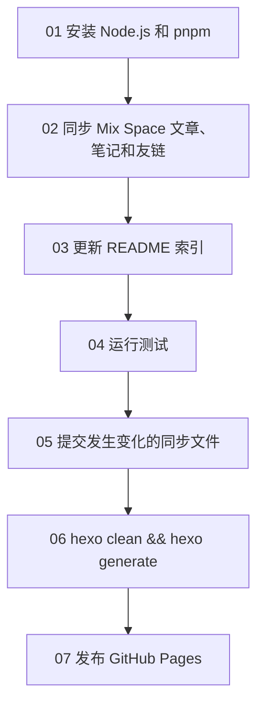

如果你已经使用 Mix Space 管理文章和笔记，又希望用 Hexo 提供一个轻量、快速、容易定制的公开站点，可以让 Hexo 仓库定期从 Mix Space API 拉取内容，再自动构建并部署到 GitHub Pages。

这个方案的重点不是把两个博客做成双向编辑系统，而是把 Mix Space 作为唯一内容源，把 Hexo 当作展示层。文章只在 Mix Space 中维护，Hexo 中的文章文件由自动化程序生成。

## 整体流程


工作流每 8 小时运行一次，也可以由 `push` 或手动操作触发。每次运行都会重新读取线上公开内容，生成当前完整的文章目录，然后执行 Hexo 构建。

## 为什么从 API 全量同步

只追加新文章看起来更简单，但无法正确处理删除、隐藏和修改。当前实现每次都读取文章和笔记的完整列表：

```text
GET /api/v3/posts?page=1&size=50&truncate=1
GET /api/v3/notes?page=1&size=50&withSummary=1
```

列表接口返回分页信息后，程序会一直请求到 `page === total_pages`。列表只用于获得文章身份和摘要，随后会为每一项请求详情：

```text
GET /api/v3/posts/{id}
GET /api/v3/notes/nid/{nid}?single=1
```

这样可以拿到标题、正文、标签、分类、创建时间、修改时间和原始路由等字段。未登录请求只能获得 Mix Space 允许公开的内容，未发布、定时未公开、密码内容不会被同步。

## 文章和笔记如何共存

文章和笔记使用不同的 API 身份：

| 类型 | 稳定身份 | 原站路径 |
| --- | --- | --- |
| 文章 | `post:{id}` | `/posts/{categorySlug}/{slug}` |
| 笔记 | `note:{id}` | `/notes/{nid}` |

同步程序不会使用标题作为身份，因为标题可以修改。它使用 Mix Space 返回的不可变 `id`，并把文章和笔记分别标记为 `post:id` 或 `note:id`。

## 数字编号只负责 Hexo 内部路径

Hexo 站点的文章路径使用数字编号，例如：

```text
/archives/1/
/archives/2/
/archives/3/
```

编号与 Mix Space 的文章 ID 没有直接关系，而是保存在根目录的 `.content-sync-map.json` 中。第一次同步时，程序会按照创建时间分配下一个数字；后续同步通过 `post:id` 或 `note:id` 找回原来的编号。

这带来两个好处：

1. 修改标题、分类或 Mix Space slug 不会改变 Hexo 永久链接。
2. 已经使用过的编号不会重新分配给另一篇内容。

所以不要手动重命名 `source/_posts/1.md` 这类文件，也不要删除映射文件。它们是同步程序保持永久路径的依据。

## 原文链接如何自动生成

每篇生成的 Hexo 文件都会写入 `original_url`：

```yaml
original_url: https://moitr.ren/posts/categories/example
```

文章的原文路径由分类 slug 和文章 slug 组合而成，笔记则使用它的 `nid`：

```text
文章：/posts/{category.slug}/{slug}
笔记：/notes/{nid}
```

域名是固定的 `https://moitr.ren`。这样即使 Hexo 使用数字归档路径，读者仍然可以从文章页回到 Mix Space 原文。**这需要你的主题支持**

## 正文格式和 Core 容器

当 `content_format` 为 `markdown` 时，程序使用 API 返回的 `text`。当格式为 `lexical` 时，当前实现同样优先使用 Mix Space 提供的公开 `text`，避免在同步端重复实现编辑器 JSON 的全部渲染规则。

同步阶段还会处理 Mix Space 的部分自定义 Markdown 容器。例如：

- `masonry` 容器会转换成 Hexo 主题已有的图片画廊结构。
- `success` 容器会转换成 Markdown 引用块。
- 未知容器保持原样，避免自动同步误删原文。

换行会统一为 LF，正文尾部只保留一个换行，时间统一写成 UTC ISO 格式。这样 Windows 本地运行和 Linux Actions 运行也能得到稳定的文件内容。

## 修改、删除和 API 失败时会发生什么

同步不是向目录里无限追加文件，而是先在临时目录生成全部结果，确认数量和文章 payload 都有效后，再一次性替换 `source/_posts`。

- Mix Space 修改正文或发布时间：对应数字文件会被更新。
- Mix Space 删除或隐藏内容：对应文件会从当前站点移除，并在映射中标记为 inactive。
- 之前使用过的数字：即使文章被删除，也不会重新分配。
- API 请求失败：程序会在写入前直接失败，保留本地原有文章和映射，不发布一个不完整的网站。

这也是全量同步比简单下载脚本更重要的地方：删除能够生效，网络故障也不会把线上站点替换成半套内容。

## GitHub Actions 的构建顺序

工作流的核心步骤如下：



当前定时表达式是：

```yaml
- cron: "20 */8 * * *"
```

GitHub Actions 使用 UTC 时间，因此对应北京时间每天 00:20、08:20 和 16:20。需要立即更新时，可以推送到 `main`，或在 Actions 页面手动运行工作流。

## 需要保留的文件

同步功能主要由以下文件组成：

```text
tools/sync-content.js       # 拉取 API、规范化数据、生成文章
.content-sync-map.json      # Mix Space 身份到数字编号的永久映射
.github/workflows/deploy-pages.yml
source/_posts/              # 自动生成的 Hexo 文章目录
```

`source/_posts` 中的数字 Markdown 属于自动生成内容，不建议直接编辑。下一次同步时，线上 API 内容会覆盖本地手动修改。

## 本地验证

在提交工作流之前，可以先运行：

```bash
pnpm install --frozen-lockfile
pnpm content:sync
pnpm test
pnpm clean
pnpm build
```

如果 API 暂时不可用，`pnpm content:sync` 应该失败且不改变现有文章。构建完成后，可以检查 `public/archives/` 是否生成了归档页和数字文章路径。

## 常见注意事项

### 1.不要删除映射文件

删除 `.content-sync-map.json` 会让程序失去旧文章与数字编号的对应关系。重新同步时，内容可能被当作全新文章分配新的路径。

### 2.不要只请求第一页

文章数量超过 50 后，第一页并不代表完整数据。必须根据 `meta.pagination.total_pages` 请求所有页面，否则站点会悄悄缺文章。

### 3.不要把 API 密钥放进前端

当前公开内容接口不需要登录，Actions 直接请求即可。如果以后改成需要认证的接口，应把凭据放在 GitHub Actions Secrets，并只在工作流中使用，不能写入主题 JavaScript 或生成的 HTML。

## 总结

Mix Space 负责内容管理，GitHub Actions 负责定期获取和验证，Hexo 负责生成静态页面，GitHub Pages 负责分发。通过稳定的远程身份、不可复用的数字编号和失败保护机制，可以在不手动维护 Hexo 文章文件的情况下，保持原博客与个人主页之间可靠同步。
